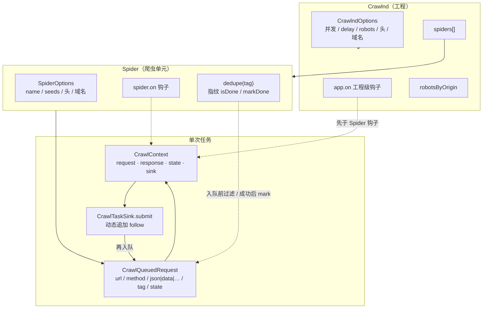
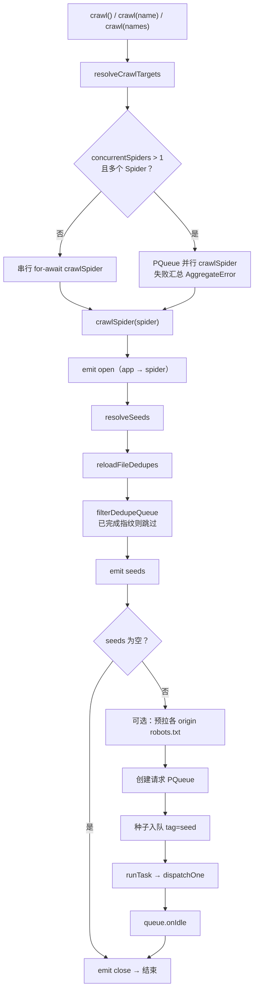

# Crawlnd 功能说明与路线图

> 文档版本：与一期管理台控制面对齐  
> 配套接口契约：[`admin-api.md`](./admin-api.md)  
> 前端联调清单：[`admin-frontend-prep.md`](./admin-frontend-prep.md)

本文描述 **Crawlnd 爬虫运行时 + Admin 管理插件** 当前已具备的能力，以及建议的后续建设方向。

站点实现通过装配层 `registerSpider` 注入，**不属于框架本体**；抽取框架时以 `core` + `admin`（及可选 utils）为准，业务 Spider 留在应用仓。

---

## 1. 产品定位

Crawlnd 提供：

1. **怎么爬（core）**：Spider 模型、种子与调度、并发/限速、生命周期钩子  
2. **怎么管（admin）**：HTTP 控制面——选 Spider、填参、启停 Run、查日志与统计  
3. **怎么定时**：cron 计划到点 `createRun`  
4. **怎么配**：App / Spider 配置套餐存表，创建任务时选用并固化快照  

**一期边界：** 单人使用、单 admin 进程、密码门鉴权；不做多租户；不做在线改代码 / DAG。

---

## 2. 总体架构

```
┌─────────────────────────────────────────────────────────┐
│  管理前端（应用仓（自建前端））                          │
│  登录 / 仪表盘 / Spider / Run / 日志 / Schedule / Profile │
└───────────────────────────┬─────────────────────────────┘
                            │ HTTP + Bearer JWT
┌───────────────────────────▼─────────────────────────────┐
│  Admin 插件（框架）                                        │
│  鉴权 · Registry · Runs · Schedules · Profiles · Logs    │
│  Stats · 进程内 Scheduler                                 │
└─────────────┬───────────────────────────┬───────────────┘
              │ registerSpider(s)         │ new Crawlnd + crawl
┌─────────────▼─────────────┐   ┌─────────▼───────────────┐
│  应用侧站点装配（非框架）    │   │  Core（框架）             │
│  各业务 Spider 工厂         │   │  Crawlnd · Spider · 调度 │
└───────────────────────────┘   └─────────────────────────┘
              │
     应用自备：MySQL / Redis / 结果表（框架只约定 runs/logs/schedules/profiles 等控制面表）
```

**依赖与抽取约定：**

| 包/目录 | 归属 | 说明 |
|---------|------|------|
| `src/core` | 框架 | 零业务站点知识 |
| `src/admin` | 框架插件 | 只依赖 core / 控制面 DB；**禁止** import 具体站点 |
| 可选 utils | 与站点无关工具（page-seeds、logger 等）；**分页 schema 辅助在 admin `param-schema`** |
| 站点工厂 + `register-*` | **应用仓** | 通过 `registerSpider` 注入 |
| 管理前端 | 应用仓 | 对接 admin-api |

组合根（应用仓）：注册站点 → `startAdminServer`。  
CLI 直跑可不加载 admin。

---

## 2.1 Core 内部架构

`src/core` 是零业务依赖的爬虫运行时。对外主入口：`Crawlnd`（工程）+ `Spider`（爬虫定义）+ `dispatchFetch`（单次 HTTP）。

### 2.1.1 模块结构

```
src/core/   （已迁至 packages/core）
├── index.ts
├── crawlnd.ts
├── spider.ts
├── context.ts
├── dispatcher.ts
├── html-select.ts
├── robots.ts
├── request-fingerprint.ts
├── seed-fingerprint-file.ts
└── frontier/
```

```
                    ┌──────────────────────────────────────┐
                    │              Crawlnd                  │
                    │  options · spiders[] · app hooks      │
                    │  robotsByOrigin 缓存                   │
                    └───────────────┬──────────────────────┘
                                    │ useSpider / crawl(name?)
              ┌─────────────────────┼─────────────────────┐
              ▼                     ▼                     ▼
        ┌──────────┐         ┌──────────┐          ┌────────────┐
        │  Spider  │         │  Spider  │   ...    │  PQueue    │
        │  hooks   │         │  incr.   │          │ concurrent │
        │  seeds   │         └──────────┘          │ Spiders    │
        └────┬─────┘                               └────────────┘
             │ 每 Spider：seed → Frontier → 本机 fetch workers
             ▼
        ┌─────────────────────────────────────────┐
        │  Frontier（默认 Memory；可换 Redis）      │
        │  sink.submit → frontier.push             │
        │  concurrentRequests 个 worker：fetch→…  │
        │  delay>0 → concurrency=1 + 间隔休眠       │
        └─────────────────┬───────────────────────┘
                          │ dispatchOne
                          ▼
        ┌─────────────────────────────────────────┐
        │  校验 validDomains → robots → hooks      │
        │  → dispatchFetch (undici) → afterResponse│
        │  → sink.submit 可继续入队 (tag=follow)   │
        └─────────────────────────────────────────┘
```

### 2.1.2 核心对象关系



### 2.1.3 `crawl()` 调度流程



**两级并发：**

| 层级 | 配置 | 含义 |
|------|------|------|
| Spider 之间 | `concurrentSpiders` | 同时跑几个 Spider |
| Spider 之内 | `concurrentRequests` | 单个 Spider 内同时多少 HTTP |
| 限速 | `delay`（ms） | `>0` 时该 Spider 内强制串行，且请求开始间隔休眠 |

### 2.1.4 单请求管道（`dispatchOne`）

```
入队请求 (CrawlQueuedRequest)
        │
        ▼
┌─ 去重（follow 等）：若 tag 有规则且 isDone(指纹) → 直接跳过 ─┐
        │
        ▼
构建 CrawlRequest：合并 headers
  Crawlnd.defaultHeaders ← Spider.defaultHeaders ← request.headers
        │
        ▼
assertRequestHostnameAllowed
  （工程 validDomains 与 Spider validDomains 同时配置时须都满足）
        │
        ▼
可选 assertRobotsAllowsUrl（obeyRobotsTxt）
        │
        ▼
组装 CrawlContext { request, state, sink }
        │
        ▼
emit beforeRequest（app → spider；可按 tag 过滤）
        │
        ▼
dispatchFetch(ctx)  ── undici
  · URL：params 占位 + query 合并
  · Body：json > formData > data
  · Cookie / Proxy
  · 响应：status、headers、body；HTML 可挂 select / selectAll
  · 或 ctx.respond() 短接（不发真请求）
        │
        ▼
emit afterResponse（app → spider）
        │
        ▼
成功则 dedupe.markDone(指纹)（若该 tag 启用）
        │
        ▼
异常 → emit error（仍向上抛；队列内其它任务继续）
```

业务侧典型写法：在 `afterResponse` 里解析 `ctx.response`，需要翻页/详情时 `ctx` 上的 **sink**（或钩子入参里的 sink）`submit` 新请求（默认 `tag=follow`）。

### 2.1.5 事件模型

工程与 Spider 事件名相同，便于统一订阅：

| 事件 | 时机 | 工程级额外参数 |
|------|------|----------------|
| `open` | 本轮 Spider 开始、尚未解析种子 | `(spider)` |
| `seeds` | 种子列表已解析（去重过滤后） | `(spider, requests)` |
| `beforeRequest` | 即将 fetch | `(ctx)` |
| `afterResponse` | fetch 成功且写入 response | `(ctx)` |
| `error` | fetch 或 afterResponse 抛错 | `(err, ctx)` |
| `close` | 本轮结束（空种子/中途失败也会进） | `(spider)` |

钩子顺序：**同一事件先跑 Crawlnd（app）再跑 Spider**。  
`beforeRequest` / `afterResponse` / `error` 支持按 `request.tag` 过滤（两参数默认偏 seed；三参数可指定 tag 或 `*`）。

### 2.1.6 请求与上下文（数据面）

| 类型 | 作用 |
|------|------|
| `CrawlRequest` | HTTP 语义：url、method、headers、query、params、data/json/formData、cookies、proxy、tag |
| `CrawlQueuedRequest` | 入队用；可附带 `state`（不进 HTTP，进 `ctx.state`） |
| `CrawlContext` | 单次任务上下文：request、response、state、以及入队 sink |
| `CrawlTaskSink` | **唯一入队口**：种子与后续 follow 共用同一队列实现 |
| `tag` | 默认 `seed`（首批）/ `follow`（submit）；也可自定义，供钩子与 dedupe 匹配 |

### 2.1.7 辅助能力

| 模块 | 职责 |
|------|------|
| `dispatcher` | 真正发 HTTP；body 优先级 json → formData → data |
| `html-select` | 对文本/HTML 响应做选择器封装 |
| `robots` | 按 origin 缓存 robots.txt；404 视为无限制 |
| `request-fingerprint` | 规范化请求后算哈希，供去重 |
| `seed-fingerprint-file` | `{ fingerprints: string[] }` 本地持久化 |
| `Spider.dedupe` | 按 tag 注册；`stateFile` / `stateDir` / 自定义回调三选一 |

### 2.1.8 与 Admin 的边界

```
Admin createRun
    → createSpiderFromRegistry(params, ctx)   // 应用注册的工厂，返回 Spider
    → new Crawlnd(appConfigSnapshot)
    → useSpider(spider)
    → crawl(spiderName)
         │
         └── 全程只依赖 core API；落库/去重/业务字段在 Spider 钩子里由应用完成
```

Core **不包含**：HTTP 管理 API、任务表、站点工厂、结果表 schema。

---

## 3. 当前已支持功能（详细）

### 3.1 爬虫核心（core）

详细模块图、调度与单请求管道见 **§2.1 Core 内部架构**。能力摘要：

| 能力 | 说明 |
|------|------|
| Spider 模型 | `name`、seeds / startUrls、defaultHeaders、validDomains、生命周期钩子 |
| 工程选项 | `concurrentRequests`、`concurrentSpiders`、`delay`、`obeyRobotsTxt`、工程级 defaultHeaders / validDomains |
| 请求头合并 | 工程头 ← Spider 头 ← 单次请求头（后者覆盖） |
| 动态入队 | `CrawlTaskSink.submit` → `frontier.push`；默认 tag `seed` / `follow` |
| 请求去重 | 按 tag 的指纹文件或自定义 `isDone` / `markDone`；与 Job 级 DupeFilter 可并存 |
| Frontier | 可插拔：默认 `MemoryFrontier`；`RedisFrontier` 支持请求级分布式 |
| 事件 | open / seeds / beforeRequest / afterResponse / error / close（工程级先于 Spider） |
| 分布式 API | `seedJob` / `runFetchLoop`；Admin：`CRAWL_FRONTIER=redis` + `npm run worker` |

### 3.2 Admin：注册中心与动态表单

- 空注册表 + `registerSpider` / `registerSpiders`  
- `GET /api/spiders`：返回已注册项的 `name` / `label` / `description` / `paramSchema`  
- 附带默认 App / Spider Profile id，便于前端预选  
- 参数形态由各 Spider 的 `paramSchema` 声明；框架不绑定具体业务字段  

### 3.3 鉴权（单人密码门）

- `.env`：`ADMIN_PASSWORD` 非空则启用  
- `POST /api/auth/login` → JWT；业务接口需 `Authorization: Bearer <token>`  
- 白名单：`/api/health`、`/api/auth/login`、`/api/auth/status`  
- 不做多用户体系；抽取后仍可作为默认简易门，或由应用替换鉴权中间件  

### 3.4 任务 Run

| 能力 | 说明 |
|------|------|
| 创建并启动 | `POST /api/runs`，异步执行 |
| 列表 / 详情 | 支持按 `scheduleId` 过滤 |
| 停止 | 协作式 cancel（当前请求轮次可能仍跑完） |
| 状态 | `pending` \| `running` \| `succeeded` \| `failed` \| `cancelled` |
| 触发来源 | `manual` \| `schedule` + 可选 `scheduleId` |
| 统计回写 | 结束时 `stats`：`pages` / `items` / `saved` / `skipped` / `errors`（由站点 logger 累计） |
| 配置快照 | `appProfileId` / `spiderProfileId` + 固化 `appConfig` / `spiderConfig`；`options` 可单次覆盖 |

执行路径：解析 Profile → 写 snapshot → `createSpiderFromRegistry(params, { runId, spiderConfig })` → `new Crawlnd(appConfig)` → `crawl`。

### 3.5 日志

| 能力 | 说明 |
|------|------|
| 任务日志 | `GET /api/runs/:id/logs`（正序） |
| 全局日志 | `GET /api/logs`（倒序；筛 spider / level / event / runId；`beforeId` 翻页） |
| 约定事件 | 站点使用统一 logger 时常见：`start` → `seeds` → `page` → `done` / `error` |
| `run_id` | Admin 创建时注入，便于按任务过滤 |
| 推送 | 一期无 SSE，前端轮询 |

控制面表：`crawl_logs`（框架建表/升级）。

### 3.6 定时计划 Schedule

| 能力 | 说明 |
|------|------|
| 模型 | Schedule = 配置；到点 `createRun`（与手动同一执行链） |
| 表达式 | 5 段 cron + `timezone` |
| 启停 / 立即触发 | 支持；禁用不取消正在跑的 Run |
| 重叠 | 一期仅 `skip` |
| 实现 | admin 进程内 tick（间隔可配） |
| 约束 | **单实例**；多进程会重复触发 |

控制面表：`crawl_schedules`。

### 3.7 App / Spider 配置套餐（Profile）

| 层级 | 控制面表 | 一期字段 |
|------|----------|----------|
| App | `crawl_app_profiles` | concurrentRequests、concurrentSpiders、delay、obeyRobotsTxt、defaultHeaders、validDomains |
| Spider | `crawl_spider_profiles` | defaultHeaders、validDomains（**不含**业务 params） |

- 多套命名 + `isDefault` / set-default  
- 无默认 App Profile 时启动 seed「系统默认」（来自环境变量）  
- 执行只用 snapshot，改 Profile 不影响历史 Run  
- Spider 头：工厂内置 ← Profile 同名覆盖（由应用工厂配合 `SpiderCreateContext`）  

### 3.8 平台概览

`GET /api/stats/overview`：

- Run 总数、按状态 / 触发方式、成功率、近 24h / 7 天、进行中  
- 历史 stats 累加  
- 按已注册 spider 名汇总  
- Schedule 数量 / 启用数；日志总数 / error 数  

成功率：`succeeded / (succeeded + failed)`。

### 3.9 控制面持久化（框架表）

| 表 | 用途 |
|----|------|
| `crawl_runs` | 任务与 snapshot、stats |
| `crawl_logs` | 运行日志 |
| `crawl_schedules` | 定时计划 |
| `crawl_app_profiles` | App 配置套餐 |
| `crawl_spider_profiles` | Spider 运行时套餐 |

**不属于框架：** 各业务结果表、站点私有 Redis key 设计——由应用仓自行维护。

### 3.10 环境与启动（框架侧约定）

典型环境变量（名称以 `.env.example` 为准）：MySQL、Redis（若应用使用）、Admin 监听、默认并发、`ADMIN_PASSWORD`、调度间隔等。

```bash
# 应用仓示例：装配站点后启动 admin
npm run admin
```

---

## 4. 已知限制（一期）

1. 停止为协作式，不够「硬中断」。  
2. 调度仅单 admin 实例。  
3. 无实时推送（SSE / WebSocket）。  
4. 框架不提供「业务结果表」通用查询（结果形态因站而异，留给应用）。  
5. Profile 中敏感头若明文入库，有泄露风险。  
6. `stats` 多在任务结束时回写，运行中不一定有。  

---

## 5. 将来要做的功能（路线图）

面向**框架与 Admin 插件**，不含具体站点需求。

### 5.1 P1 — 高价值

| 项 | 目标 |
|----|------|
| SSE / WebSocket | 任务日志与进度推送 |
| 取消粒度细化 | 尽量中断 in-flight 请求 |
| 运行中 stats | 周期回写或推送 |
| 可选：结果查询扩展点 | 由应用注册「结果浏览器」或通用只读 SQL 适配器，**框架不绑死表结构** |

### 5.2 P2 — 定时与可靠性

| 项 | 目标 |
|----|------|
| Schedule `queue` / `replace` | 更丰富重叠策略 |
| 失败重试 / Webhook 通知 | 可插拔通知 |
| cron 预览 | 下次 N 次触发时间 |
| 可选 catch-up | 带上限的补跑 |
| 多实例分布式锁 | 安全水平扩展调度 |
| 官方守护示例 | pm2 / systemd |

### 5.3 P3 — 安全与可插拔鉴权

| 项 | 目标 |
|----|------|
| 鉴权中间件可替换 | 应用接入自有 SSO / RBAC |
| Profile 密钥引用 | 敏感值不进明文 JSON |
| 审计日志 | 配置与启停操作留痕 |
| 部署指南 | 反代、HTTPS |

### 5.4 P4 — 工程化

| 项 | 目标 |
|----|------|
| 发布为独立 npm 包 | `crawlnd`、`@crawlnd/admin` 等 |
| OpenAPI / 类型导出 | 减少前后端漂移 |
| 日志导出 | JSONL 下载 |
| 并发与队列可视化 | 控制面可观测性 |

### 5.5 请求级分布式（Frontier 可插拔）

| 项 | 目标 |
|----|------|
| `Frontier` / `DupeFilter` 接口 | 进 core；默认 `MemoryFrontier` |
| `RedisFrontier` | 共享队列 + 租约 ack + Job 级 seen |
| `seedJob` / `runFetchLoop` | 协调侧只入种子；Worker 拉取执行 |
| Job Supervisor | depth+inflight 稳定窗口判定完成；cancel / lease 回收 |
| Admin | Run 可选 `frontier=redis`；多 Worker 共消费同一 runId |

**分层：** 接口与 Memory 在 core；Redis 为实现插件；Worker/Supervisor 在 admin 侧。

### 5.6 明确不做或远期

- 在管理台编辑 Spider 源码  
- 通用可视化 DAG（除非单独立项）  
- 未明确需求前的多租户  

---

## 6. 抽取框架时的建议切分

本仓库已按 workspaces 落地：

```
packages/
  core/     → crawlnd     运行时（Spider / Frontier / Memory+Redis 实现）
  utils/    → @crawlnd/utils    page-seeds、logger、条目/Job stats 工具
  admin/    → @crawlnd/admin    HTTP 控制面；须 configureAdmin 注入 env/pool
src/
  apps/     → admin-main / worker-main（装配根）
  bootstrap/→ 把应用 .env 与 MySQL pool 注入 admin
  app/site → 业务 Spider（放在应用仓，不进本仓库）
  config/   → 应用环境变量
  db/       → 应用 MySQL 连接池
```

依赖方向：`app → @crawlnd/admin → @crawlnd/utils → crawlnd`。  
应用启动：`bootstrapCrawlndRuntime()` → `registerProjectSpiders()` → `startAdminServer` / worker 循环。

---

## 7. 相关文档

| 文档 | 用途 |
|------|------|
| [`admin-api.md`](./admin-api.md) | HTTP 契约（含当前应用注册的 Spider 示例时，以运行时 `/api/spiders` 为准） |
| [`admin-frontend-prep.md`](./admin-frontend-prep.md) | 前端页面与联调 |
| 本文 | 框架能力全景与路线图 |

---

## 8. 一句话总结

**现在：** 框架提供可注册的爬虫运行时与完整 Admin 控制面（任务、日志、定时、配置套餐、概览、单人鉴权）；业务站点通过注册注入，与框架解耦。  

**下一步：** 优先实时日志/进度与更硬的取消，再强化调度可靠性与可插拔鉴权，并以 npm 包形式抽出 `core` + `admin`。
